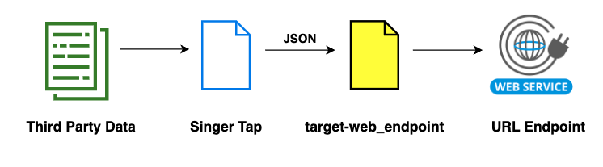

# target-web_endpoint

Author: Jay Grossman (jay@grossman.org)

This is a [Singer](http://singer.io) tap that produces JSON-formatted data following the [Singer spec](https://github.com/singer-io/getting-started/blob/master/SPEC.md).

## Description

This is a fun learning project with the goal to create a Singer target that can:
1. Send record data (piped from a tap) to a url endpoint via HTTP GET or HTTP Post.
2. Allows for configuration of basic auth credentials and HTTP Headers for HTTP Post method.
3. Allows for configuration to map source data field names to target system's data field names.
4. Allows for configuration to specify additional properties (with static values) to send to endpoint.
5. Allows for configuration to specify VERY BASIC filter rules based on the record values.


## Usage

**Install**

I suggest running this is a python virtual environment:

```bash
cd target-web_endpoint
python3 -m venv ~/.virtualenvs/target-web_endpoint
source ~/.virtualenvs/target-web_endpoint/bin/activate
git clone git@github.com:jaygrossman/target-web_endpoint.git
cd target-web_endpoint
pip install requests
pip install -e .
deactivate
```

**Create a configuration file**

There is a template you can use at `config.json.example`, just copy it to `config.json` in the repo root and update the following values:
```json
{
  "method" : "POST",
  "url": "https://api.some_web_site.com/lisitngs/", 
  "username": "my_username",
  "password": "my_password",
  "post_headers" : {
      "Content-Type": "application/x-www-form-urlencoded"
    }, 
  "property_mapping": {
    "field1": { "target_field_name": "target_field_1"},
    "field2": { "target_field_name": "target_field_2"},
    "field3": { "target_field_name": "target_field_3"},
    "field4": { "target_field_name": "field_4"},
    "field5": { "target_field": "field_5"}
  },
  "additional_properties": {
    "system_id": 12,
    "special_key": "0cf18148-1687-11ee-be56-0242ac120002"
  },
  "filter_rules": {
    "field1": { "type": "equals", "value": true },
    "field2": { "type": "not_equals", "value": "123" },
    "field3": { "type": "is_empty", "value": false }
  }
}
```

| Variable | Description |
| ----------- | ----------- |
| method | method for calling url (GET or POST), default is GET |
| url | endpoint url - **REQUIRED**|
| username | user name for basic auth (only for POST) |
| password | password  for basic auth (only for POST) |
| post_headers | dict of headers to pass  (only for POST)  |
| property_mapping | define the properties received from tap to be sent to the endpoint. You can update the target property names)  |
| additional_properties | define additional properties with hard coded values that will be sent to the HTTP Post  |
| filter_rules | configure rules to only include records when matching all criteria. |

`Notes about fi# target-web_endpoint

Author: Jay Grossman (jay@grossman.org)

This is a [Singer](http://singer.io) tap that produces JSON-formatted data following the [Singer spec](https://github.com/singer-io/getting-started/blob/master/SPEC.md).

## Description

This is a fun learning project with the goal to create a Singer target that can:
1. Send record data (piped from a tap) to a url endpoint via HTTP GET or HTTP Post.
2. Allows for configuration of auth creds and HTTP Headers for HTTP Post method.
3. Allows for configuration to map source data field names to target system's data field names.
4. Allows for configuration to specify additional properties (with static values) to send to endpoint.
5. Allows for configuration to specify VERY BASIC filter rules based on the record values.




## Usage

**Install**

I suggest running this is a python virtual environment:

```bash
cd target-web_endpoint
python3 -m venv ~/.virtualenvs/target-web_endpoint
source ~/.virtualenvs/target-web_endpoint/bin/activate
git clone git@github.com:jaygrossman/target-web_endpoint.git
cd target-web_endpoint
pip install requests
pip install -e .
deactivate
```

**Create a configuration file**

There is a template you can use at `config.json.example`, just copy it to `config.json` in the repo root and update the following values:
```json
{
  "method" : "POST",
  "url": "https://api.some_web_site.com/lisitngs/", 
  "username": "my_username",
  "password": "my_password",
  "post_headers" : {
      "Content-Type": "application/x-www-form-urlencoded"
    }, 
  "property_mapping": {
    "field1": { "target_field_name": "target_field_1"},
    "field2": { "target_field_name": "target_field_2"},
    "field3": { "target_field_name": "target_field_3"},
    "field4": { "target_field_name": "field_4"},
    "field5": { "target_field": "field_5"}
  },
  "additional_properties": {
    "system_id": 12,
    "special_key": "0cf18148-1687-11ee-be56-0242ac120002"
  },
  "filter_rules": {
    "field1": { "type": "equals", "value": true },
    "field2": { "type": "not_equals", "value": "123" },
    "field3": { "type": "is_empty", "value": false }
  }
}
```

| Variable | Description |
| ----------- | ----------- |
| method | method for calling url (GET or POST), default is GET |
| url | endpoint url - **REQUIRED**|
| username | user name for basic auth (only for POST) |
| password | password  for basic auth (only for POST) |
| post_headers | dict of headers to pass  (only for POST)  |
| property_mapping | define the properties received from tap to be sent to the endpoint. You can update the target property names)  |
| additional_properties | define additional properties with hard coded values that will be sent to the endpoint  |
| filter_rules | configure rules to only include records when matching all criteria. |

`Notes about filter_rules`:
1. Records will be sent to the endpoint only when they are valid for all the configured rules. 
2. You can only identify one rule for each field.
3. There are 5 supported types of rules:

| Rule Type | Description |
| ----------- | ----------- |
| equals | the field's value must equal the configured *value*  |
| not_equals | the field's value must not equal the configured *value*  |
| contains | the field's value must contain the configured *value*  |
| not_contains | the field's value must not contain the configured *value*  |
| is_empty | if true, the field's value must not be empty. if false, the field's value must be empty  |

**Syntax to pipe data to the target.**
```bash
~/.virtualenvs/target-web_endpoint/bin/target-web_endpoint -c config.json
```

## EXAMPLE: Running the Tap-Csv + Target-web_endpoint

The [sample_data](sample_data) folder in this github repo includes:
1. [sample_data.csv](sample_data/sample_data.csv) file contains a github keyword search
2. [tap-csv.config.json](sample_data/tap-csv.config.json) file contains config for the tap-csv
3. [target-web_endpoint.config.json](sample_data/target-web_endpoint.config.json) file contains config for the target-web_endpoint
 
Calling this thread will try to search github (https://github.com/search) via a HTTP GET request with the keywords supplied in [sample_data.csv](sample_data/sample_data.csv).

**Install tap-csv**
```bash
python3 -m venv ~/.virtualenvs/tap-csv
source ~/.virtualenvs/tap-csv/bin/activate
pip install git+https://github.com/MeltanoLabs/tap-csv.git
deactivate
```

**Run command to generate csv**

```bash
~/.virtualenvs/tap-csv/bin/tap-csv --config sample_data/tap-csv.config.json | ~/.virtualenvs/target-web_endpoint/bin/target-web_endpoint --config sample_data/target-web_endpoint.config.json

```
It returns the following:

```bash
2023-06-29 23:17:10,957 | INFO     | tap-csv              | Beginning full_table sync of 'seacrhes'...
2023-06-29 23:17:10,957 | INFO     | tap-csv              | Tap has custom mapper. Using 1 provided map(s).
2023-06-29 23:17:10,957 | INFO     | singer_sdk.metrics   | METRIC: {"type": "timer", "metric": "sync_duration", "value": 0.000225067138671875, "tags": {"stream": "seacrhes", "context": {}, "status": "succeeded"}}
2023-06-29 23:17:10,957 | INFO     | singer_sdk.metrics   | METRIC: {"type": "counter", "metric": "record_count", "value": 1, "tags": {"stream": "seacrhes", "context": {}}}
url: https://github.com/search?q=tap-ebaycompleted, response: <Response [200]>
{"bookmarks": {"seacrhes": {}}}
```